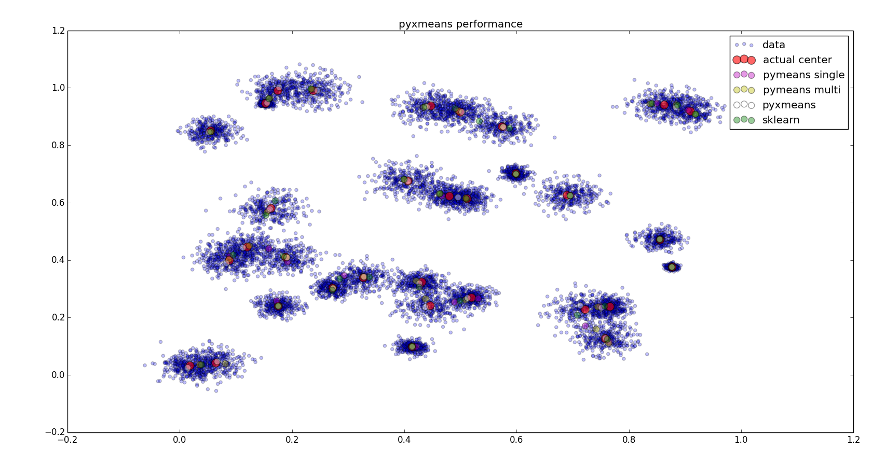

## pyxmeans

This is a quick implementation of
[XMeans](http://www.cs.cmu.edu/~dpelleg/download/xmeans.pdf) for using kmeans
type clustering with an unknown number of clusters.  In order to make this code
runnable, I chose to use MiniBatchKMeans instead of KMeans, but they should be
swappable. 

Currently MiniBatch and XMeans are supported.  XMeans uses multiple MiniBatch
and trial MiniBatch runs in order to infer how many clusters the data has.  It
does so by taking the population of a given cluster center, splitting it, and
seeing if the resulting labels have a better BIC (Bayesian Information
Criterion) than before.  This can be done successively until we find the number
of clusters.

In addition to providing XMeans, the MiniBatch implementation in this package is
exceedingly fast.  Below are benchmarks for all the provided clustering methods
and sklearn's MiniBatch routine.


```
$ python -m pyxmeans.benchmark
Creating data
Number of points:  10000
Number of dimensions:  2
Number of clusters:  32
initial BIC:  -50362.6636213
initial variance:  0.00139526682125
initial RMS Error:  2.63545562649

Clustering with single-threaded pyxmeans
singlethreaded pyxmeans took 0.044637s
BIC:  -51030.9046731
Variance:  0.000893989133563
RMS Error:  2.61327999377

Clustering with multi-threaded pyxmeans
multithreaded pyxmeans took 0.343579s
BIC:  -50976.5201592
Variance:  0.00090523484603
RMS Error:  2.61341727462

Clustering with multi-threaded pyxmeans (k in (26,36))
multithreaded pyxmeans took 36.425922s
Num Clusters:  34
BIC:  -51931.8839323
Variance:  0.000862645312699
RMS Error:  2.61321981998

Clustering with sklearn
scikitlearn took 9.610394s
BIC:  -50464.636064
Variance:  0.000952063085393
RMS Error:  2.61890108593
```



NOTES: 

    * `max_no_improvement` is set to `None` for MiniBatchKMeans to properly
      compare per-iteration speeds since we currently do not support
      early-stopping.
    * RMS Error for the multi-threaded pymeans is higher because that function
      aims at minimizing the variance of the resulting model.


### Dependencies

* [numpy](http://numpy.org/)

### Todo:

* Optimize data layout when dealing with / comparing computed clusters
* Early stopping mechanism
